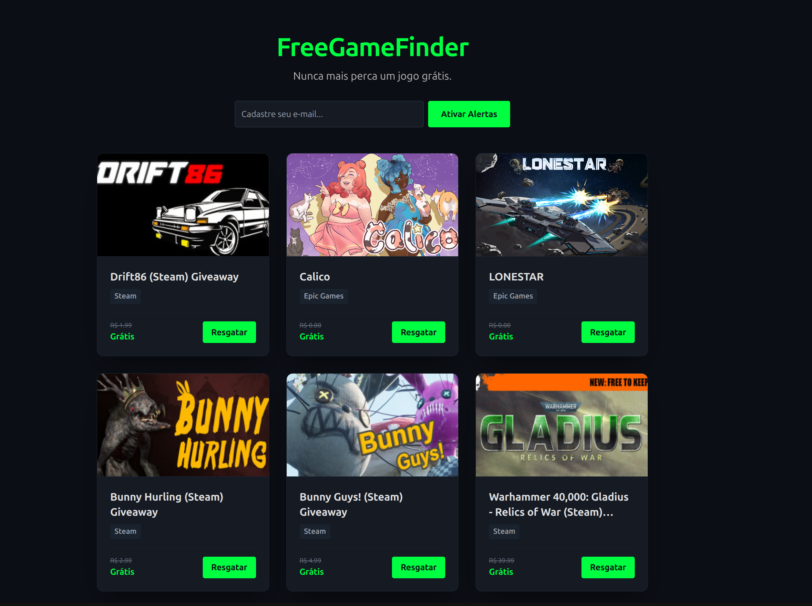

# FreeGameFinder



FreeGameFinder e uma aplicacao full stack para encontrar jogos temporariamente gratuitos, centralizar as ofertas em uma interface simples e permitir que usuarios recebam alertas por e-mail.

O projeto usa um backend em FastAPI para coletar dados da Epic Games Store e de ofertas Steam via GamerPower, persiste os jogos em PostgreSQL e expoe uma API consumida por um frontend React com Vite e Tailwind CSS.

## Funcionalidades

- Listagem de jogos gratuitos encontrados nas fontes configuradas.
- Coleta automatica a cada 30 minutos com APScheduler.
- Cadastro de e-mail para alertas.
- Confirmacao de inscricao por double opt-in.
- API REST com endpoint de saude para verificar conexao com o banco.
- Ambiente local com Docker Compose.

## Stack

- Backend: Python 3.11, FastAPI, SQLAlchemy, APScheduler, httpx.
- Frontend: React 18, Vite, Tailwind CSS.
- Banco de dados: PostgreSQL 15.
- E-mail: SMTP via fastapi-mail.
- Infra local: Docker e Docker Compose.

## Estrutura

```text
.
├── backend/
│   ├── main.py              # API, modelos, rotas e agendador
│   ├── scraper.py           # Coleta e normalizacao das ofertas
│   ├── email_utils.py       # Envio de e-mail de confirmacao
│   ├── requirements.txt
│   └── Dockerfile
├── frontend/
│   ├── src/
│   │   ├── App.jsx          # Interface principal
│   │   ├── main.jsx
│   │   └── index.css
│   ├── package.json
│   ├── tailwind.config.js
│   ├── vite.config.js
│   └── Dockerfile
├── docker-compose.yml
├── ideia.md                 # Documento de produto/arquitetura inicial
└── .env.example
```

## Requisitos

- Docker e Docker Compose.
- Opcional para desenvolvimento sem Docker:
  - Python 3.11+
  - Node.js 20+
  - PostgreSQL 15+

## Configuracao

Crie um arquivo `.env` na raiz a partir do exemplo:

```bash
cp .env.example .env
```

Preencha os dados de SMTP antes de testar inscricao por e-mail. Para uso local com Docker, os valores de PostgreSQL do exemplo ja funcionam.

Variaveis principais:

- `POSTGRES_USER`: usuario do banco usado pelo container.
- `POSTGRES_PASSWORD`: senha do banco usado pelo container.
- `POSTGRES_DB`: nome do banco.
- `DATABASE_URL`: URL de conexao usada pelo backend.
- `MAIL_USERNAME`: usuario SMTP.
- `MAIL_PASSWORD`: senha, app password ou chave do provedor SMTP.
- `MAIL_FROM`: remetente dos e-mails.
- `MAIL_PORT`: porta SMTP.
- `MAIL_SERVER`: servidor SMTP.
- `MAIL_STARTTLS`: habilita STARTTLS.
- `MAIL_SSL_TLS`: habilita SSL/TLS direto.
- `FRONTEND_URL`: URL publica/local do frontend.

## Subindo o projeto com Docker

Este e o caminho recomendado para deixar tudo rodando localmente ou em uma VPS simples.

### 1. Clonar o repositorio

```bash
git clone https://github.com/protonnegativo/FreeGameFinder.git
cd FreeGameFinder
```

### 2. Criar o arquivo de ambiente

```bash
cp .env.example .env
```

Para rodar com o `docker-compose.yml` deste projeto, mantenha o banco apontando para o servico `db`:

```env
DATABASE_URL=postgresql://postgres:postgres@db:5432/freegamefinder
```

Se quiser testar o cadastro por e-mail, preencha tambem as variaveis SMTP:

```env
MAIL_USERNAME=seu_usuario_smtp
MAIL_PASSWORD=sua_senha_ou_app_password
MAIL_FROM=seu_email@dominio.com
MAIL_PORT=587
MAIL_SERVER=smtp.seuprovedor.com
MAIL_STARTTLS=True
MAIL_SSL_TLS=False
FRONTEND_URL=http://localhost:5173
```

Sem SMTP configurado, a listagem de jogos continua funcionando, mas o envio do e-mail de confirmacao de inscricao pode falhar.

### 3. Construir e iniciar os containers

Na raiz do projeto:

```bash
docker compose up --build
```

Para rodar em segundo plano:

```bash
docker compose up -d --build
```

Servicos expostos:

- Frontend: `http://localhost:5173`
- Backend: `http://localhost:8000`
- Documentacao da API: `http://localhost:8000/docs`
- Health check: `http://localhost:8000/api/v1/health`
- PostgreSQL: `localhost:5432`

Ao iniciar, o backend cria as tabelas automaticamente e executa uma primeira coleta de jogos.

### 4. Conferir se esta tudo rodando

Veja os containers:

```bash
docker compose ps
```

Teste a API:

```bash
curl http://localhost:8000/api/v1/health
curl http://localhost:8000/api/v1/games
```

Abra o frontend no navegador:

```text
http://localhost:5173
```

### 5. Comandos uteis

Ver logs de todos os servicos:

```bash
docker compose logs -f
```

Ver logs apenas do backend:

```bash
docker compose logs -f backend
```

Parar os containers:

```bash
docker compose down
```

Parar e apagar o volume do banco local:

```bash
docker compose down -v
```

Recriar depois de mudar dependencias ou Dockerfiles:

```bash
docker compose up -d --build
```

## Subindo em uma VPS

Em uma VPS com Docker instalado, o fluxo basico e:

```bash
git clone https://github.com/protonnegativo/FreeGameFinder.git
cd FreeGameFinder
cp .env.example .env
nano .env
docker compose up -d --build
```

Depois, libere as portas necessarias no firewall/provedor:

- `5173`: frontend Vite exposto pelo container.
- `8000`: API FastAPI.
- `5432`: PostgreSQL, apenas se voce realmente precisar acessar o banco fora da VPS.

Para uso publico, o ideal e colocar Caddy, Nginx ou outro proxy reverso na frente da aplicacao e publicar somente HTTP/HTTPS. Nesse caso, atualize `FRONTEND_URL` no `.env` para o dominio real.

## Executando sem Docker

Backend:

```bash
cd backend
python -m venv .venv
source .venv/bin/activate
pip install -r requirements.txt
uvicorn main:app --reload
```

Frontend:

```bash
cd frontend
npm install
npm run dev
```

Nesse modo, confirme que `DATABASE_URL` aponta para um PostgreSQL acessivel.

## Endpoints

Base local: `http://localhost:8000`

- `GET /`: mensagem de boas-vindas.
- `GET /api/v1/games`: lista jogos encontrados, ordenados pelos mais recentes.
- `POST /api/v1/subscribe`: cadastra um e-mail e envia confirmacao.
- `GET /api/v1/subscribe/confirm?token=...`: confirma a inscricao.
- `GET /api/v1/health`: verifica conectividade com o banco.

Exemplo de inscricao:

```bash
curl -X POST http://localhost:8000/api/v1/subscribe \
  -H "Content-Type: application/json" \
  -d '{"email":"usuario@example.com"}'
```

## Fontes de dados

- Epic Games Store: API publica de promocoes gratuitas para `pt-BR`/Brasil.
- Steam: API publica da GamerPower filtrada para giveaways de jogos na plataforma Steam.

As fontes externas podem mudar formato, disponibilidade ou limites. O scraper registra falhas em log e retorna lista vazia quando uma fonte nao responde.

## Cuidados de seguranca

- Nao envie o arquivo `.env`; ele contem credenciais e esta no `.gitignore`.
- Use senhas fortes para PostgreSQL e SMTP fora do ambiente local.
- Evite expor a porta `5432` publicamente em VPS.
- Confira se nao ha chaves, senhas ou dados pessoais em arquivos de codigo ou documentacao.
- Arquivos gerados como `__pycache__`, `node_modules`, `dist` e volumes locais ja estao ignorados.

## Status e proximos passos

O projeto ja possui a base funcional de API, coleta, frontend e inscricao. Melhorias naturais para as proximas versoes:

- Parametrizar a URL da API no frontend com variavel `VITE_API_URL`.
- Usar `FRONTEND_URL`/URL de backend real no link de confirmacao por e-mail.
- Adicionar filtros por plataforma e status da oferta.
- Criar testes automatizados para parser do scraper e rotas principais.
- Adicionar rota de descadastro.
- Enviar alertas apenas quando novos jogos forem encontrados.
